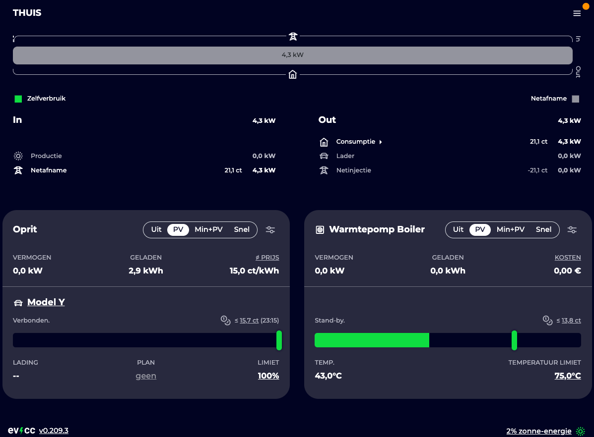

# EVCC Home Setup (Redacted)

This repo contains a **redacted** `evcc.yaml`. Replace the placeholders like `<REDACTED-IP>`, `<REDACTED-TOKEN>`, and `<REDACTED-PASSWORD>` with your real values locally **before running EVCC**.




## What’s inside
- `evcc.yaml` — Your EVCC configuration (IPs, tokens, and passwords redacted).
- `docker-compose.yml` — Minimal compose to run EVCC with this config.
- `.gitignore` — Keeps local data/db and secrets out of Git.
- `evcc_dashboard.jpg` — UI screenshot for the README.

## Quick start (Docker)
1. Edit `evcc.yaml` and replace every `<REDACTED-...>` placeholder with your real values.
2. Start EVCC:
   ```bash
   docker compose up -d
   ```
3. Open the UI:
   - mDNS hostname: `http://evcc.local:7070`
   - or via localhost: `http://localhost:7070`
4. Check logs:
   ```bash
   docker compose logs -f evcc
   ```

> Default config locations are `/etc/evcc.yaml` or the same directory as the binary; you can also pass a custom path via `-c`. See the official docs for details.  


## My ESPHome version for PoE BLE Proxy for Tesla can be found on my github page
https://github.com/donnyvangulik/esphome-teslable-poe
## Useful EVCC docs
- **Introduction / Home**: Overview & concepts.  
  https://docs.evcc.io/en/docs/Home
- **Create `evcc.yaml`**: Guided configuration assistant & manual editing.  
  https://docs.evcc.io/en/docs/installation/configuration
- **`evcc.yaml` reference**: File location, structure, and examples.  
  https://docs.evcc.io/en/docs/reference/configuration
- **Chargers**: Supported chargers (Modbus TCP, etc.).  
  https://docs.evcc.io/en/docs/devices/chargers
- **Meters (Grid / PV / Aux)**: Templates like Shelly, SmartFox, etc.  
  https://docs.evcc.io/en/docs/devices/meters
- **MQTT config**: Broker, topic, user/password.  
  https://docs.evcc.io/en/docs/reference/configuration/mqtt
- **Sponsor token**: How to set `sponsortoken:`.  
  https://docs.evcc.io/en/docs/reference/configuration/sponsortoken

## License
You may copy and adapt this template for your own use.
